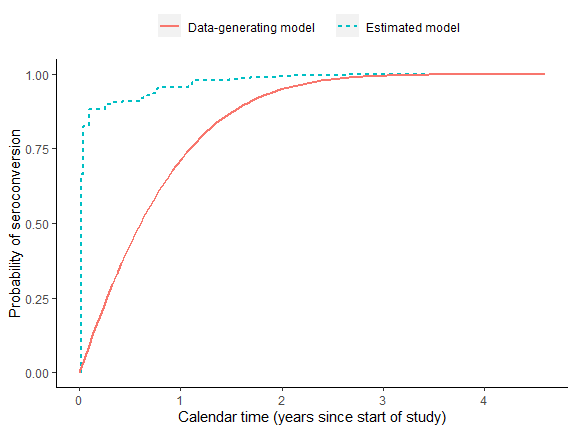
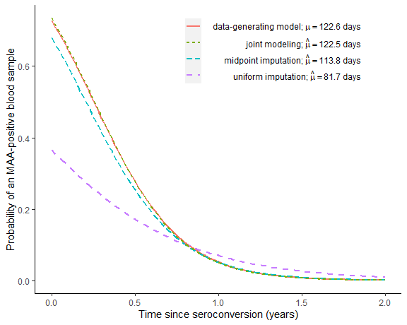

<!-- README.md is generated from README.Rmd. Please edit that file -->

# rwicc

<!-- badges: start -->

[](https://github.com/d-morrison/rwicc/actions)
<!-- badges: end -->

`rwicc` (“Regression With Interval-Censored Covariates”) is an R
software package implementing an analysis for a regression model
involving an interval-censored covariate, as described in “Regression
with Interval-Censored Covariates: Application to Cross-Sectional
Incidence Estimation” by Morrison, Laeyendecker, and Brookmeyer
(Biometrics, 2021): <https://doi.org/10.1111/biom.13472>.

This analysis uses a joint model for the distributions of the outcome of
interest and the interval-censored covariate, which is treated as a
latent variable; the model parameters are estimated by maximum
likelihood using an EM algorithm. The submodel used for the distribution
of the interval-censored covariate is somewhat specific to the
application of interest (estimation of the mean duration of a
biomarker-defined window period for cross-sectional incidence
estimation), so this package may not be immediately applicable to other
problems. We are publishing it with the goal of making the results in
our paper easier to reproduce and with the hope that others might adapt
pieces of this code for their own applications. Please feel free to
[contact us](mailto:dmorrison01@ucla.edu) with any questions about the
code or the paper!

## Installation

You can install the current released version from
[CRAN](https://cran.r-project.org) with:

``` r
install.packages("rwicc")
```

You can install the development version from
[GitHub](https://github.com/) with:

``` r
install.packages("devtools")
devtools::install_github("d-morrison/rwicc")
```

## Example of use

First, we simulate some data:

``` r
set.seed(1)

library(rwicc)
theta_true = c(0.986, -3.88)
hazard_alpha = 1
hazard_beta = 0.5
sim_data = simulate_interval_censoring(
  "theta" = theta_true,
  "study_cohort_size" = 4500,
  "preconversion_interval_length" = 365,
  "hazard_alpha" = hazard_alpha,
  "hazard_beta" = hazard_beta)

# extract the participant-level and observation-level simulated data:
sim_participant_data = sim_data$pt_data
sim_obs_data = sim_data$obs_data
rm(sim_data)
```

Here’s a look at the first few rows of participant-level data:

``` r
library(pander)
pander(head(sim_participant_data))
```

| ID  |     E      |     L      |     R      |
|:---:|:----------:|:----------:|:----------:|
|  1  | 2001-06-16 | 2001-06-16 | 2002-06-17 |
|  2  | 2001-05-09 | 2001-05-09 | 2002-05-06 |
|  3  | 2001-10-26 | 2001-10-26 | 2002-10-30 |
|  4  | 2001-09-27 | 2001-09-27 | 2002-09-25 |
|  5  | 2001-07-06 | 2001-07-06 | 2002-06-29 |
|  6  | 2001-11-03 | 2001-11-03 | 2002-11-02 |

-   `E` is the individual’s enrollment date
-   `L` is the date of the last HIV-negative test
-   `R` is the date of the first HIV-positive test

Next, let’s look at the first few rows of observation-level
(longitudinal) data:

``` r
pander(head(sim_obs_data))
```

| ID  |     O      |  Y  |
|:---:|:----------:|:---:|
|  1  | 2002-06-17 |  1  |
|  1  | 2002-07-15 |  0  |
|  1  | 2002-08-12 |  1  |
|  1  | 2002-09-09 |  0  |
|  1  | 2002-12-02 |  0  |
|  1  | 2003-02-24 |  0  |

-   `O` is the observation date
-   `Y` is the MAA classification (1 = “recent infection”, 0 =
    “long-term infection”)

The two tables are linked by the variable `ID`.

Now, we will apply our proposed analysis (this takes a couple of
minutes; use argument `verbose = TRUE` to print progress messages):

``` r
EM_algorithm_outputs = fit_joint_model(
  obs_level_data = sim_obs_data,
  participant_level_data = sim_participant_data,
  bin_width = 7,
  verbose = FALSE)
```

The output of `fit_joint_model()` is a list with several components:

``` r
names(EM_algorithm_outputs)
#> [1] "Theta"               "Mu"                  "Omega"              
#> [4] "converged"           "iterations"          "convergence_metrics"
```

`Theta` is the vector of estimated logistic regression coefficients for
")
(intercept and slope):

``` r
pander(EM_algorithm_outputs$Theta)
```

| (Intercept) |   T    |
|:-----------:|:------:|
|    1.019    | -3.953 |

`Mu` is the corresponding

estimate:

``` r
mu_est_EM = EM_algorithm_outputs$Mu
print(mu_est_EM)
#> [1] 122.5193
```

`converged` indicates whether the algorithm reached its convergence
criterion (= 1 if converged, = 0 if not).

``` r
EM_algorithm_outputs$converged
#> [1] 1
```

`iterations` is the number of EM iterations that the algorithm
performed:

``` r
EM_algorithm_outputs$iterations
#> [1] 112
```

`convergence_metrics` gives the values of all four metrics that we might
use to evaluate convergence:

-   `diff logL`: change in log-likelihood between iterations
-   `diff mu`: change in
    
-   `max abs diff coefs`:
    } - \hat{\theta}_j^{(k-1)}|\}")
-   `max abs rel diff coefs`:
    } - \hat{\theta}_j^{(k-1)})/\hat{\theta}_j^{(k-1)}|\}")

By default, the convergence criterion is: `diff logL` \< 0.1 and
`max abs rel diff coefs` \< 0.0001.

``` r
pander(EM_algorithm_outputs$convergence_metrics)
```

| diff logL | diff mu  | max abs diff coefs | max abs rel diff coefs |
|:---------:|:--------:|:------------------:|:----------------------:|
| 0.008769  | 0.008171 |     0.0001012      |       9.931e-05        |

Next, we perform an alternative analysis using midpoint imputation:

``` r
theta_est_midpoint = fit_midpoint_model(
  obs_level_data = sim_obs_data,
  participant_level_data = sim_participant_data
)

pander(theta_est_midpoint)
```

| (Intercept) | T_midpoint |
|:-----------:|:----------:|
|   0.7572    |   -3.662   |

Here, we perform an alternative analysis using uniform imputation:

``` r
# uniform imputation:
theta_est_uniform = fit_uniform_model(
  obs_level_data = sim_obs_data,
  participant_level_data = sim_participant_data
)

pander(theta_est_uniform)
```

| theta0 | theta1 |
|:------:|:------:|
| -0.549 | -2.037 |

Now, let’s graph the results. First, let’s plot the true and estimated
CDFs for the distribution of seroconversion date, for individuals who
enroll on the first calendar day of the cohort study:

``` r
plot1 = plot_CDF(
  true_hazard_alpha = hazard_alpha,
  true_hazard_beta = hazard_beta,
  omega.hat = EM_algorithm_outputs$Omega)

print(plot1)
```



We can see that our joint modeling approach hasn’t estimated this
distribution very accurately for this particular simulated dataset.
Nevertheless, the next graph will show us that the joint model very
accurately estimates the true distribution
")
and the true value of
:

``` r
plot2 = plot_phi_curves(
  theta_true = theta_true,
  theta.hat_uniform = theta_est_uniform,
  theta.hat_midpoint = theta_est_midpoint,
  theta.hat_joint = EM_algorithm_outputs$Theta)

print(plot2)
```


