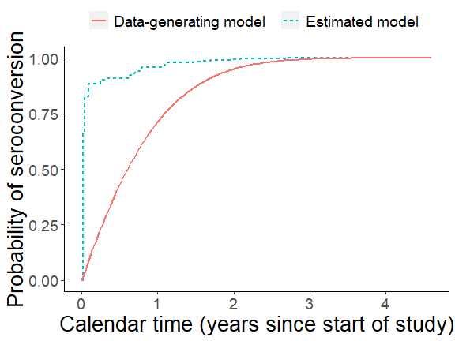

<!-- README.md is generated from README.Rmd. Please edit that file -->

# rwicc

<!-- badges: start -->

[](https://travis-ci.com/d-morrison/rwicc)
[](https://github.com/d-morrison/rwicc/actions)
<!-- badges: end -->

rwicc (“Regression With Interval-Censored Covariates”) is an R software
package implementing an analysis for a particular regression modeling
problem involving interval-censored covariates, as described in
“Regression with Interval-Censored Covariates: Application to
Cross-Sectional Incidence Estimation” by Morrison, Laeyendecker, and
Brookmeyer (2021) in Biometrics (<https://doi.org/10.1111/biom.13472>).

This analysis uses a joint model for the distributions of the outcome of
interest and the interval-censored covariates; the model is maximized
using an EM algorithm. The submodel used for the distribution of the
interval-censored covariate is somewhat specific to the application of
interest (estimation of the mean duration of a biomarker-defined window
period for cross-sectional incidence estimation), so this package may
not be immediately applicable to other problems. We are publishing it
with the goal of making the results in our paper easier to reproduce and
with the hope that others might adapt pieces of this code for their own
applications. Please feel free to [contact us](dmorrison01@ucla.edu)
with any questions about the code or the paper!

## Installation

You can install the development version from
[GitHub](https://github.com/) with:

``` r
install.packages("devtools")
devtools::install_github("d-morrison/rwicc")
```

## Example of use

Here, we simulate some data:

``` r
library(rwicc)
#> Registered S3 method overwritten by 'pryr':
#>   method      from
#>   print.bytes Rcpp

theta_true = c(0.986, -3.88)
study_cohort_size = 4500
preconversion_interval_length = 84
hazard_alpha = 1
hazard_beta = 0.5

set.seed(1)
sim_data = simulate_interval_censoring(
  theta = theta_true,
  study_cohort_size = study_cohort_size,
  preconversion_interval_length = preconversion_interval_length,
  hazard_alpha = hazard_alpha,
  hazard_beta = hazard_beta)

# extract the participant-level and observation-level simulated data:
sim_participant_data = sim_data$pt_data
sim_obs_data = sim_data$obs_data
rm(sim_data)
```

Here, we apply our proposed analysis (this takes a couple of minutes;
use argument `verbose = TRUE` to print progress messages):

``` r
# this call runs the estimation algorithm for the joint modeling approach:
EM_algorithm_outputs = fit_joint_model(
  obs_level_data = sim_obs_data,
  subject_level_data = sim_participant_data,
  bin_width = 7,
  verbose = TRUE)
#> Starting `fit_joint_model();`, mem used = 153 MB
#> initial estimate for mu = 136.9598; initial estimate for theta:
#> (Intercept)           T 
#>    1.004839   -3.509296
#> 2021-05-21 17:51:13: starting EM iteration (E step) 1; mem used = 156 MB
#> Ending E step.
#> observed-data log-likelihood = -1376.50733
#> Starting M step, mem used = 157 MB
#> Ending M step; mu = 124.24985; theta =
#> (Intercept)           T 
#>    0.859305   -3.561561
#> 
#> Change in mu = 12.7099485760009
#> Max change in theta = 0.145533808124043
#> Max relative change in theta = 0.144832996038365
#> 2021-05-21 17:51:14: starting EM iteration (E step) 2; mem used = 157 MB
#> Ending E step.
#> observed-data log-likelihood = -1361.35339
#> Change in log-likelihood = 15.1539386063691
#> Starting M step, mem used = 157 MB
#> Ending M step; mu = 123.05541; theta =
#> (Intercept)           T 
#>   0.8440553  -3.5644267
#> 
#> Change in mu = 1.19443703301211
#> Max change in theta = 0.0152496632721488
#> Max relative change in theta = 0.0177465092474811
#> 2021-05-21 17:51:14: starting EM iteration (E step) 3; mem used = 157 MB
#> Ending E step.
#> observed-data log-likelihood = -1358.60458
#> Change in log-likelihood = 2.74881887195852
#> Starting M step, mem used = 157 MB
#> Ending M step; mu = 122.97213; theta =
#> (Intercept)           T 
#>   0.8433817  -3.5654427
#> 
#> Change in mu = 0.0832880479657092
#> Max change in theta = 0.00101608182802559
#> Max relative change in theta = 0.000798073045571448
#> 2021-05-21 17:51:14: starting EM iteration (E step) 4; mem used = 157 MB
#> Ending E step.
#> observed-data log-likelihood = -1356.39072
#> Change in log-likelihood = 2.21385453220182
#> Starting M step, mem used = 157 MB
#> Ending M step; mu = 123.02082; theta =
#> (Intercept)           T 
#>   0.8443922  -3.5661281
#> 
#> Change in mu = 0.0486931138610771
#> Max change in theta = 0.0010105133763415
#> Max relative change in theta = 0.00119816852971443
#> 2021-05-21 17:51:15: starting EM iteration (E step) 5; mem used = 157 MB
#> Ending E step.
#> observed-data log-likelihood = -1354.49465
#> Change in log-likelihood = 1.89607265676955
#> Starting M step, mem used = 157 MB
#> Ending M step; mu = 123.08311; theta =
#> (Intercept)           T 
#>   0.8456294  -3.5668897
#> 
#> Change in mu = 0.0622898715912044
#> Max change in theta = 0.00123717433387749
#> Max relative change in theta = 0.00146516554421512
#> 2021-05-21 17:51:15: starting EM iteration (E step) 6; mem used = 157 MB
#> Ending E step.
#> observed-data log-likelihood = -1352.92438
#> Change in log-likelihood = 1.57026517083091
#> Starting M step, mem used = 157 MB
#> Ending M step; mu = 123.13809; theta =
#> (Intercept)           T 
#>    0.846882   -3.567895
#> 
#> Change in mu = 0.0549797172180604
#> Max change in theta = 0.00125260756129697
#> Max relative change in theta = 0.00148127255620356
#> 2021-05-21 17:51:15: starting EM iteration (E step) 7; mem used = 157 MB
#> Ending E step.
#> observed-data log-likelihood = -1351.63993
#> Change in log-likelihood = 1.2844570636762
#> Starting M step, mem used = 157 MB
#> Ending M step; mu = 123.18473; theta =
#> (Intercept)           T 
#>   0.8480877  -3.5690456
#> 
#> Change in mu = 0.0466385573264603
#> Max change in theta = 0.0012057607272663
#> Max relative change in theta = 0.00142376479338275
#> 2021-05-21 17:51:16: starting EM iteration (E step) 8; mem used = 157 MB
#> Ending E step.
#> observed-data log-likelihood = -1350.57404
#> Change in log-likelihood = 1.06588811922143
#> Starting M step, mem used = 157 MB
#> Ending M step; mu = 123.22538; theta =
#> (Intercept)           T 
#>   0.8492124  -3.5702011
#> 
#> Change in mu = 0.0406495318493256
#> Max change in theta = 0.00115548340284599
#> Max relative change in theta = 0.00132610242190487
#> 2021-05-21 17:51:16: starting EM iteration (E step) 9; mem used = 157 MB
#> Ending E step.
#> observed-data log-likelihood = -1349.66997
#> Change in log-likelihood = 0.904063733001749
#> Starting M step, mem used = 157 MB
#> Ending M step; mu = 123.26184; theta =
#> (Intercept)           T 
#>   0.8502418  -3.5712803
#> 
#> Change in mu = 0.0364593539986089
#> Max change in theta = 0.0010792671684503
#> Max relative change in theta = 0.00121216546535454
#> 2021-05-21 17:51:16: starting EM iteration (E step) 10; mem used = 157 MB
#> Ending E step.
#> observed-data log-likelihood = -1348.88886
#> Change in log-likelihood = 0.781118520149903
#> Starting M step, mem used = 157 MB
#> Ending M step; mu = 123.29517; theta =
#> (Intercept)           T 
#>   0.8511761  -3.5722529
#> 
#> Change in mu = 0.0333363020701825
#> Max change in theta = 0.000972586168021206
#> Max relative change in theta = 0.00109891311173311
#> 2021-05-21 17:51:17: starting EM iteration (E step) 11; mem used = 157 MB
#> Ending E step.
#> observed-data log-likelihood = -1348.20487
#> Change in log-likelihood = 0.683982046709389
#> Starting M step, mem used = 157 MB
#> Ending M step; mu = 123.32602; theta =
#> (Intercept)           T 
#>   0.8520227  -3.5731155
#> 
#> Change in mu = 0.030849475798064
#> Max change in theta = 0.000862562844769155
#> Max relative change in theta = 0.000994593389976783
#> 2021-05-21 17:51:17: starting EM iteration (E step) 12; mem used = 157 MB
#> Ending E step.
#> observed-data log-likelihood = -1347.60021
#> Change in log-likelihood = 0.604662277344687
#> Starting M step, mem used = 157 MB
#> Ending M step; mu = 123.35479; theta =
#> (Intercept)           T 
#>   0.8527909  -3.5738759
#> 
#> Change in mu = 0.0287635829284767
#> Max change in theta = 0.000768214133165634
#> Max relative change in theta = 0.00090163577970543
#> 2021-05-21 17:51:17: starting EM iteration (E step) 13; mem used = 157 MB
#> Ending E step.
#> observed-data log-likelihood = -1347.06188
#> Change in log-likelihood = 0.538330911352205
#> Starting M step, mem used = 157 MB
#> Ending M step; mu = 123.38173; theta =
#> (Intercept)           T 
#>   0.8534899  -3.5745455
#> 
#> Change in mu = 0.0269440229395457
#> Max change in theta = 0.000699013232236645
#> Max relative change in theta = 0.000819677176745616
#> 2021-05-21 17:51:18: starting EM iteration (E step) 14; mem used = 157 MB
#> Ending E step.
#> observed-data log-likelihood = -1346.57997
#> Change in log-likelihood = 0.481912647024274
#> Starting M step, mem used = 157 MB
#> Ending M step; mu = 123.40704; theta =
#> (Intercept)           T 
#>   0.8541278  -3.5751356
#> 
#> Change in mu = 0.0253088506155734
#> Max change in theta = 0.0006378627280621
#> Max relative change in theta = 0.000747358255509319
#> 2021-05-21 17:51:18: starting EM iteration (E step) 15; mem used = 157 MB
#> Ending E step.
#> observed-data log-likelihood = -1346.14665
#> Change in log-likelihood = 0.433316712745182
#> Starting M step, mem used = 157 MB
#> Ending M step; mu = 123.43084; theta =
#> (Intercept)           T 
#>   0.8547113  -3.5756565
#> 
#> Change in mu = 0.0238061708551953
#> Max change in theta = 0.000583513406941072
#> Max relative change in theta = 0.00068316875713015
#> 2021-05-21 17:51:19: starting EM iteration (E step) 16; mem used = 157 MB
#> Ending E step.
#> observed-data log-likelihood = -1345.75561
#> Change in log-likelihood = 0.391044346846456
#> Starting M step, mem used = 157 MB
#> Ending M step; mu = 123.45325; theta =
#> (Intercept)           T 
#>   0.8552461  -3.5761172
#> 
#> Change in mu = 0.0224028429947651
#> Max change in theta = 0.000534855111115062
#> Max relative change in theta = 0.000625772844712157
#> 2021-05-21 17:51:19: starting EM iteration (E step) 17; mem used = 157 MB
#> Ending E step.
#> observed-data log-likelihood = -1345.40163
#> Change in log-likelihood = 0.353980468485361
#> Starting M step, mem used = 157 MB
#> Ending M step; mu = 123.47433; theta =
#> (Intercept)           T 
#>   0.8557371  -3.5765252
#> 
#> Change in mu = 0.0210780248100946
#> Max change in theta = 0.000490988830904149
#> Max relative change in theta = 0.000574090672722482
#> 2021-05-21 17:51:19: starting EM iteration (E step) 18; mem used = 157 MB
#> Ending E step.
#> observed-data log-likelihood = -1345.08035
#> Change in log-likelihood = 0.321273192721037
#> Starting M step, mem used = 157 MB
#> Ending M step; mu = 123.49414; theta =
#> (Intercept)           T 
#>   0.8561883  -3.5768871
#> 
#> Change in mu = 0.0198189956742851
#> Max change in theta = 0.000451214195120953
#> Max relative change in theta = 0.000527281311974331
#> 2021-05-21 17:51:20: starting EM iteration (E step) 19; mem used = 157 MB
#> Ending E step.
#> observed-data log-likelihood = -1344.7881
#> Change in log-likelihood = 0.292257872248456
#> Starting M step, mem used = 157 MB
#> Ending M step; mu = 123.51276; theta =
#> (Intercept)           T 
#>   0.8566033  -3.5772087
#> 
#> Change in mu = 0.018618291528739
#> Max change in theta = 0.000414990747378607
#> Max relative change in theta = 0.000484695629837075
#> 2021-05-21 17:51:20: starting EM iteration (E step) 20; mem used = 157 MB
#> Ending E step.
#> observed-data log-likelihood = -1344.52169
#> Change in log-likelihood = 0.266406213657774
#> Starting M step, mem used = 157 MB
#> Ending M step; mu = 123.53023; theta =
#> (Intercept)           T 
#>   0.8569852  -3.5774949
#> 
#> Change in mu = 0.0174717289381192
#> Max change in theta = 0.000381897660662212
#> Max relative change in theta = 0.000445827895297861
#> 2021-05-21 17:51:20: starting EM iteration (E step) 21; mem used = 157 MB
#> Ending E step.
#> observed-data log-likelihood = -1344.2784
#> Change in log-likelihood = 0.243290989647448
#> Starting M step, mem used = 157 MB
#> Ending M step; mu = 123.54661; theta =
#> (Intercept)           T 
#>   0.8573368  -3.5777500
#> 
#> Change in mu = 0.0163770676861077
#> Max change in theta = 0.0003516003552817
#> Max relative change in theta = 0.000410275863649965
#> 2021-05-21 17:51:21: starting EM iteration (E step) 22; mem used = 157 MB
#> Ending E step.
#> observed-data log-likelihood = -1344.05584
#> Change in log-likelihood = 0.222561107394768
#> Starting M step, mem used = 157 MB
#> Ending M step; mu = 123.56195; theta =
#> (Intercept)           T 
#>   0.8576607  -3.5779776
#> 
#> Change in mu = 0.0153331294261818
#> Max change in theta = 0.000323825484562001
#> Max relative change in theta = 0.000377710921986559
#> 2021-05-21 17:51:21: starting EM iteration (E step) 23; mem used = 157 MB
#> Ending E step.
#> observed-data log-likelihood = -1343.85191
#> Change in log-likelihood = 0.203923787257736
#> Starting M step, mem used = 157 MB
#> Ending M step; mu = 123.57628; theta =
#> (Intercept)           T 
#>    0.857959   -3.578181
#> 
#> Change in mu = 0.0143392343759245
#> Max change in theta = 0.000298343196534878
#> Max relative change in theta = 0.00034785692287654
#> 2021-05-21 17:51:21: starting EM iteration (E step) 24; mem used = 157 MB
#> Ending E step.
#> observed-data log-likelihood = -1343.66478
#> Change in log-likelihood = 0.187131694764048
#> Starting M step, mem used = 157 MB
#> Ending M step; mu = 123.58968; theta =
#> (Intercept)           T 
#>    0.858234   -3.578364
#> 
#> Change in mu = 0.0133948545262115
#> Max change in theta = 0.000274954972092623
#> Max relative change in theta = 0.000320475654982531
#> 2021-05-21 17:51:22: starting EM iteration (E step) 25; mem used = 157 MB
#> Ending E step.
#> observed-data log-likelihood = -1343.49281
#> Change in log-likelihood = 0.171973545425089
#> Starting M step, mem used = 157 MB
#> Ending M step; mu = 123.60218; theta =
#> (Intercept)           T 
#>   0.8584874  -3.5785276
#> 
#> Change in mu = 0.0124994113102872
#> Max change in theta = 0.000253485460929181
#> Max relative change in theta = 0.000295357064133093
#> 2021-05-21 17:51:22: starting EM iteration (E step) 26; mem used = 157 MB
#> Ending E step.
#> observed-data log-likelihood = -1343.33454
#> Change in log-likelihood = 0.158267154830355
#> Starting M step, mem used = 157 MB
#> Ending M step; mu = 123.61383; theta =
#> (Intercept)           T 
#>   0.8587212  -3.5786751
#> 
#> Change in mu = 0.0116521680037778
#> Max change in theta = 0.000233777075150488
#> Max relative change in theta = 0.000272312749684394
#> 2021-05-21 17:51:22: starting EM iteration (E step) 27; mem used = 157 MB
#> Ending E step.
#> observed-data log-likelihood = -1343.18869
#> Change in log-likelihood = 0.145854218970499
#> Starting M step, mem used = 157 MB
#> Ending M step; mu = 123.62468; theta =
#> (Intercept)           T 
#>   0.8589369  -3.5788082
#> 
#> Change in mu = 0.0108521829450297
#> Max change in theta = 0.000215686429318018
#> Max relative change in theta = 0.000251171655269143
#> 2021-05-21 17:51:23: starting EM iteration (E step) 28; mem used = 157 MB
#> Ending E step.
#> observed-data log-likelihood = -1343.05409
#> Change in log-likelihood = 0.134596327029612
#> Starting M step, mem used = 157 MB
#> Ending M step; mu = 123.63478; theta =
#> (Intercept)           T 
#>    0.859136   -3.578929
#> 
#> Change in mu = 0.0100983009297124
#> Max change in theta = 0.000199081992256822
#> Max relative change in theta = 0.000231777202282747
#> 2021-05-21 17:51:23: starting EM iteration (E step) 29; mem used = 157 MB
#> Ending E step.
#> observed-data log-likelihood = -1342.92972
#> Change in log-likelihood = 0.12437185992826
#> Starting M step, mem used = 157 MB
#> Ending M step; mu = 123.64417; theta =
#> (Intercept)           T 
#>   0.8593198  -3.5790383
#> 
#> Change in mu = 0.00938916739903561
#> Max change in theta = 0.00018384251493786
#> Max relative change in theta = 0.000213985350634562
#> 2021-05-21 17:51:24: starting EM iteration (E step) 30; mem used = 157 MB
#> Ending E step.
#> observed-data log-likelihood = -1342.81465
#> Change in log-likelihood = 0.11507353263346
#> Starting M step, mem used = 157 MB
#> Ending M step; mu = 123.65289; theta =
#> (Intercept)           T 
#>   0.8594897  -3.5791380
#> 
#> Change in mu = 0.00872325535375751
#> Max change in theta = 0.000169855947541597
#> Max relative change in theta = 0.000197663247319374
#> 2021-05-21 17:51:24: starting EM iteration (E step) 31; mem used = 157 MB
#> Ending E step.
#> observed-data log-likelihood = -1342.70804
#> Change in log-likelihood = 0.106606410776976
#> Starting M step, mem used = 157 MB
#> Ending M step; mu = 123.66099; theta =
#> (Intercept)           T 
#>   0.8596467  -3.5792292
#> 
#> Change in mu = 0.00809889822107834
#> Max change in theta = 0.000157018654524665
#> Max relative change in theta = 0.000182688236511674
#> 2021-05-21 17:51:24: starting EM iteration (E step) 32; mem used = 157 MB
#> Ending E step.
#> observed-data log-likelihood = -1342.60915
#> Change in log-likelihood = 0.0988862823194268
#> Starting M step, mem used = 157 MB
#> Ending M step; mu = 123.66851; theta =
#> (Intercept)           T 
#>   0.8597919  -3.5793129
#> 
#> Change in mu = 0.00751432433555976
#> Max change in theta = 0.000145234807703454
#> Max relative change in theta = 0.000168947088832334
#> 2021-05-21 17:51:25: starting EM iteration (E step) 33; mem used = 157 MB
#> Ending E step.
#> observed-data log-likelihood = -1342.51731
#> Change in log-likelihood = 0.0918382997508616
#> Starting M step, mem used = 157 MB
#> Ending M step; mu = 123.67547; theta =
#> (Intercept)           T 
#>   0.8599264  -3.5793900
#> 
#> Change in mu = 0.00696769031256395
#> Max change in theta = 0.000134415882468875
#> Max relative change in theta = 0.000156335360610537
#> 2021-05-21 17:51:25: starting EM iteration (E step) 34; mem used = 157 MB
#> Ending E step.
#> observed-data log-likelihood = -1342.43192
#> Change in log-likelihood = 0.0853958324239557
#> Starting M step, mem used = 157 MB
#> Ending M step; mu = 123.68193; theta =
#> (Intercept)           T 
#>   0.8600508  -3.5794612
#> 
#> Change in mu = 0.00645711169323704
#> Max change in theta = 0.000124480211105005
#> Max relative change in theta = 0.000144756827995729
#> 2021-05-21 17:51:25: starting EM iteration (E step) 35; mem used = 157 MB
#> Ending E step.
#> observed-data log-likelihood = -1342.35242
#> Change in log-likelihood = 0.0794994853645221
#> Starting M step, mem used = 157 MB
#> Ending M step; mu = 123.68791; theta =
#> (Intercept)           T 
#>   0.8601662  -3.5795274
#> 
#> Change in mu = 0.00598068998378665
#> Max change in theta = 0.000115352567480187
#> Max relative change in theta = 0.000134122964697243
#> 2021-05-21 17:51:26: starting EM iteration (E step) 36; mem used = 157 MB
#> Ending E step.
#> observed-data log-likelihood = -1342.27832
#> Change in log-likelihood = 0.0740962525617306
#> Starting M step, mem used = 157 MB
#> Ending M step; mu = 123.69345; theta =
#> (Intercept)           T 
#>   0.8602731  -3.5795889
#> 
#> Change in mu = 0.00553653579717661
#> Max change in theta = 0.000106963769453183
#> Max relative change in theta = 0.000124352446396603
#> 2021-05-21 17:51:26: starting EM iteration (E step) 37; mem used = 157 MB
#> Ending E step.
#> observed-data log-likelihood = -1342.20918
#> Change in log-likelihood = 0.069138780915182
#> Starting M step, mem used = 157 MB
#> Ending M step; mu = 123.69857; theta =
#> (Intercept)           T 
#>   0.8603724  -3.5796465
#> 
#> Change in mu = 0.00512278804490052
#> Max change in theta = 9.92502939582973e-05
#> Max relative change in theta = 0.000115370675072694
#> 2021-05-21 17:51:26: starting EM iteration (E step) 38; mem used = 157 MB
#> Ending E step.
#> observed-data log-likelihood = -1342.1446
#> Change in log-likelihood = 0.0645847267403497
#> Starting M step, mem used = 157 MB
#> Ending M step; mu = 123.70331; theta =
#> (Intercept)           T 
#>   0.8604646  -3.5797005
#> 
#> Change in mu = 0.00473762941579992
#> Max change in theta = 9.21539002861627e-05
#> Max relative change in theta = 0.000107109317257663
#> 2021-05-21 17:51:27: starting EM iteration (E step) 39; mem used = 157 MB
#> Ending E step.
#> observed-data log-likelihood = -1342.0842
#> Change in log-likelihood = 0.0603961908043402
#> Starting M step, mem used = 157 MB
#> Ending M step; mu = 123.70769; theta =
#> (Intercept)           T 
#>   0.8605502  -3.5797513
#> 
#> Change in mu = 0.00437929846012253
#> Max change in theta = 8.56212648459032e-05
#> Max relative change in theta = 9.95058593853167e-05
#> 2021-05-21 17:51:27: starting EM iteration (E step) 40; mem used = 157 MB
#> Ending E step.
#> observed-data log-likelihood = -1342.02766
#> EM algorithm converged, based on log-likelihood and coefs, to 0.0565392207786317 change in log-likelihood, in 40 iterations.

# extract the estimated mean window period duration from the algorithm's results:
mu_est_EM = EM_algorithm_outputs$Mu
```

Next, we perform alternative analyses using midpoint imputation and
uniform imputation:

``` r
max_iterations_for_glm_fits = 1000 
# bigglm's default maxit = 8, which is not large enough to ensure convergence for this data.
# I don't think any of the scenarios examined in our paper ever get close to 1000 iterations though; 
# this is effectively saying maxit = Inf.

# midpoint imputation:
{
  
  library(dplyr)
  library(magrittr)
  library(lubridate)
  library(biglm)
  
  sim_participant_data %<>%
    mutate(S_midpoint = L + (R - L) / ddays(2))
  
  sim_obs_data %<>%
    left_join(by = "ID",
              sim_participant_data %<>% dplyr::select(ID, S_midpoint)) %>%
    mutate(T_midpoint = (O - S_midpoint) / ddays(365))
  
  phi_model_est_midpoint =
    bigglm(
      epsilon = tolerance_for_glm_fits,
      maxit = max_iterations_for_glm_fits,
      quiet = TRUE,
      data = sim_obs_data,
      family = binomial(),
      Y ~ T_midpoint
    )
  
  mu_est_midpoint = compute_mu(coef(phi_model_est_midpoint))
  
}
#> 
#> Attaching package: 'dplyr'
#> The following objects are masked from 'package:stats':
#> 
#>     filter, lag
#> The following objects are masked from 'package:base':
#> 
#>     intersect, setdiff, setequal, union
#> 
#> Attaching package: 'lubridate'
#> The following objects are masked from 'package:base':
#> 
#>     date, intersect, setdiff, union
#> Loading required package: DBI

# uniform imputation:
{
  n_imputations = 100 # 10 would be enough
  
  # create a matrix to store the results from each imputed data set
  imputed_coef_ests = matrix(nrow = n_imputations,
                             ncol = 2,
                             dimnames = list(NULL, c("theta0", "theta1")))
  
  for (i in 1:n_imputations)
  {
    
    sim_participant_data %<>%
      mutate(S_imputed =
               L +
               runif(
                 n = n(),
                 min = 0,
                 max = (R - L) / ddays(1)
               ))
    
    sim_obs_data %<>%
      dplyr::select(-any_of("S_imputed")) %>%
      left_join(sim_participant_data %>% dplyr::select(ID, S_imputed),
                by = "ID") %>%
      mutate(T_imputed = (O - S_imputed) / ddays(365))
    
    phi_model_est_imputed =
      bigglm(
        epsilon = tolerance_for_glm_fits,
        maxit = max_iterations_for_glm_fits,
        quiet = TRUE,
        data = sim_obs_data,
        family = binomial(),
        Y ~ T_imputed
      )
    
    imputed_coef_ests[i, ] = coef(phi_model_est_imputed)
    
  }
  
  imputed_coef_ests_mean = colMeans(imputed_coef_ests)
  
  mu_est_imputed = compute_mu(imputed_coef_ests_mean)
  
}
```

Now, let’s graph the results. First, let’s plot the true and estimated
CDFs for the distribution of seroconversion date, for individuals who
enroll on the first calendar day of the cohort study:

``` r
library(ggplot2)
cum_haz_fn0 = function(years_since_study_start)
{
  hazard_alpha * years_since_study_start + hazard_beta / 2 * years_since_study_start^2
}

cum_haz_fn = function(years_since_study_start,
                      `years from study start to enrollment`)
{
  cum_haz_fn0(years_since_study_start) - cum_haz_fn0(`years from study start to enrollment`)
}

surv_fn = function(years_since_study_start,
                   `years from study start to enrollment`)
  exp(-cum_haz_fn(
    years_since_study_start,
    `years from study start to enrollment`
  ))

true_model_label = "Data-generating model"
est_model_label = "Estimated model"

lwd1 = 1
omega.hat = EM_algorithm_outputs$Omega %<>%
  mutate(
    "P(S>s|E=0)" = cumprod(`P(S>s|S>=s,E=e)`),
    "P(S>=s|E=0)" = lag(`P(S>s|E=0)`, default = 1) 
  )

plot1 = ggplot(
  aes(
    y = 1 - `P(S>=s|E=0)`,
    x = (S - ymd("2001-01-01")) / ddays(365)
  ),
  data = omega.hat %>% filter(S < max(S))) +
  
  geom_step(
    direction = "hv",
    aes(col = est_model_label,
        linetype = est_model_label),
    lwd = lwd1
  ) +
  
  xlab("Calendar time (years since start of study)") +
  ylab("Probability of seroconversion") +
  geom_function(
    fun = function(x)
      1 - surv_fn(x, 0),
    aes(col = true_model_label,
        linetype = true_model_label),
    lwd = lwd1
  ) +
  
  scale_colour_discrete("") +
  scale_linetype_discrete("") +
  theme(
    axis.title.x = element_text(size = 20),
    axis.text.x = element_text(size = 14),
    axis.title.y = element_text(size = 20),
    axis.text.y = element_text(size = 14),
    panel.grid.major = element_blank(),
    panel.grid.minor = element_blank(),
    panel.background = element_blank(),
    axis.line = element_line(colour = "black"),
    legend.position = "top",
    legend.text =
      element_text(size = 14,
                   margin = margin(r = 10, unit = "pt"))
  )

print(plot1)
```



We can see that our joint modeling approach does not always estimate
this distribution very accurately at this sample size. Nevertheless, the
next graph will show us that the joint model very accurately estimates
the true distribution for *P*(*Y*\|*T*) and the true value of *μ*:

``` r
library(scales)


mu_true = compute_mu(theta_true)
phi_true = build_phi_function_from_coefs(theta_true)
phi_est_joint_modeling = build_phi_function_from_coefs(EM_algorithm_outputs$Theta)
phi_est_midpoint = build_phi_function_from_coefs(coef(phi_model_est_midpoint))
phi_est_imputed = build_phi_function_from_coefs(imputed_coef_ests_mean)

true_model_label2 = paste(sep = "",
                          "'   data-generating model;'~mu == '",
                          format(mu_true, digits = 1, nsmall = 1),
                          "'~days"
)

midpoint_label = paste(sep = "",
                       "` midpoint imputation;`~hat(mu) == '",
                       format(mu_est_midpoint, digits = 1, nsmall = 1),
                       "'~days"
)

uniform_label = paste(sep = "",
                      "`uniform imputation;`~hat(mu) == '",
                      format(mu_est_imputed, digits = 1, nsmall = 1),
                      "'~days"
)

joint_modeling_label = paste(sep = "",
                             "'  joint modeling;'~hat(mu) =='",
                             format(mu_est_EM, digits = 1, nsmall = 1),
                             "'~days"
)

lwd1 = 1


  plot2 = ggplot(data = NULL) +
    geom_function(
      fun = phi_true,
      lwd = lwd1,
      aes(colour = true_model_label2, linetype = true_model_label2)
    ) +
    geom_function(
      fun = phi_est_midpoint,
      lwd = lwd1,
      aes(colour = midpoint_label, linetype = midpoint_label)
    ) +
    geom_function(
      fun = phi_est_imputed,
      lwd = lwd1,
      aes(colour = uniform_label, linetype = uniform_label)
    ) +
    geom_function(
      fun = phi_est_joint_modeling,
      lwd = lwd1,
      aes(colour = joint_modeling_label, linetype = joint_modeling_label)
    ) +
    xlim(0, 2) +
    ylab("Probability of an MAA-positive blood sample") +
    xlab("Time since seroconversion (years)") +
    scale_colour_discrete("",   labels = label_parse()) +
    scale_linetype_discrete("", labels = label_parse()) +
    theme(
      panel.grid.major = element_blank(),
      panel.grid.minor = element_blank(),
      panel.background = element_blank(),
      axis.line = element_line(colour = "black")
    ) +
    theme(
      axis.title.x = element_text(size = 20),
      axis.text.x = element_text(size = 14),
      axis.title.y = element_text(size = 18),
      axis.text.y = element_text(size = 14),
      legend.text.align = 1,
      legend.box.just = "right",
      legend.text = element_text(size = 16),
      legend.position = c(.65, .85),
      legend.title = element_blank()
    )


print(plot2)
```


This example can also be viewed via the R command
`vignette("how-to-use-rwicc")`).
