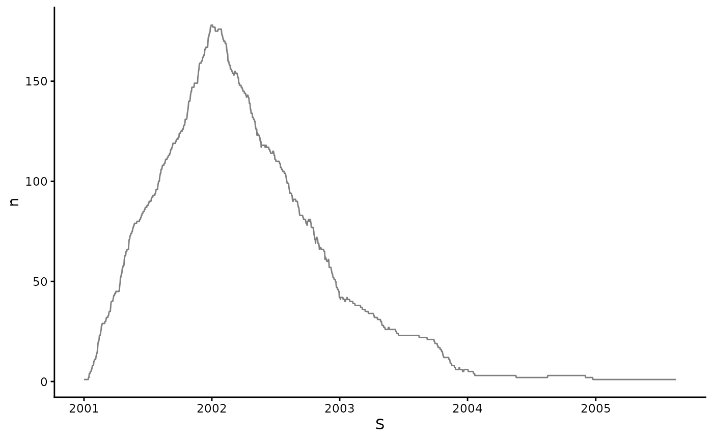
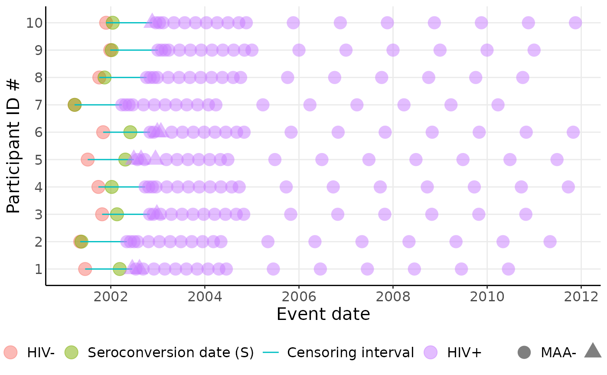
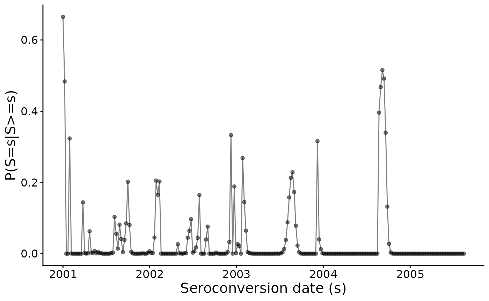
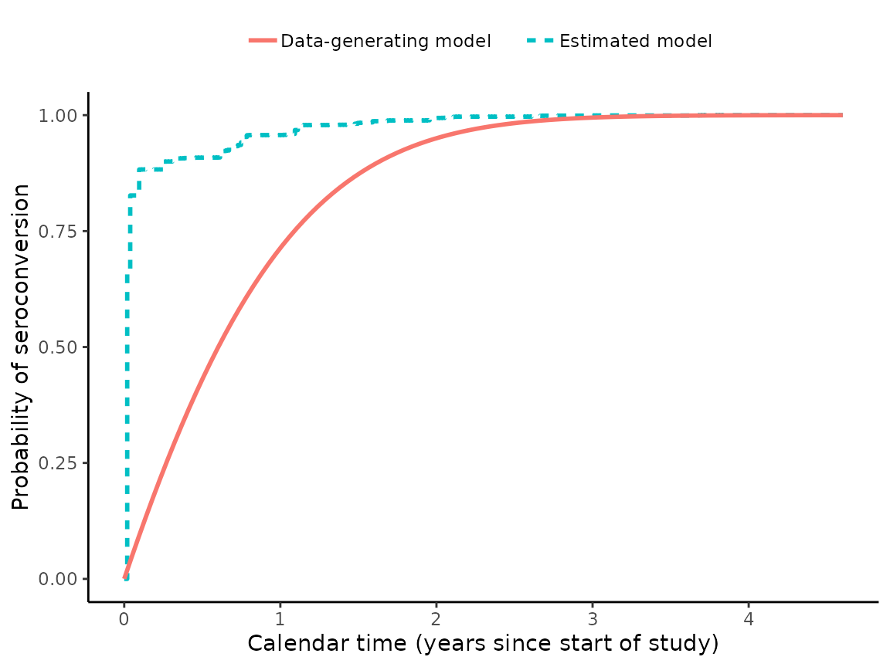
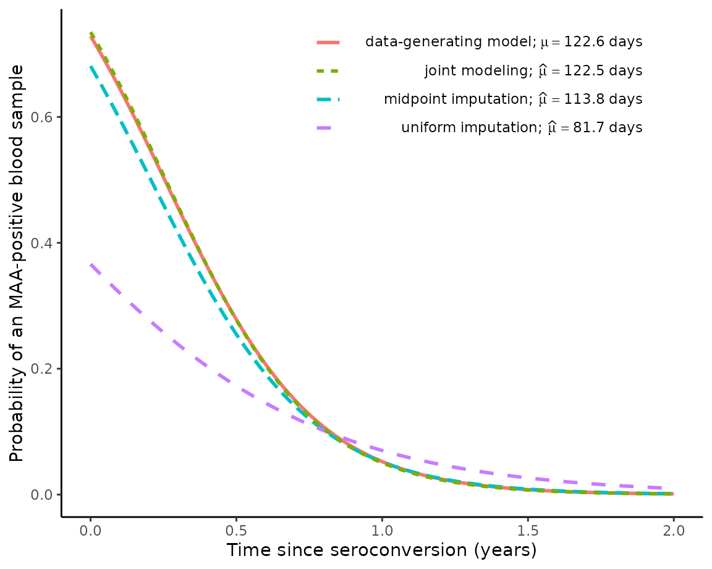

# how-to-use-rwicc

This vignette shows how to generate a simulated data set and analyze it
using the model and estimation algorithm described in “Regression with
Interval-Censored Covariates: Application to Cross-Sectional Incidence
Estimation” by Morrison, Laeyendecker, and Brookmeyer (2021) in
Biometrics: <https://onlinelibrary.wiley.com/doi/10.1111/biom.13472>.

First, we simulate some data:

``` r


set.seed(1)

library(rwicc)
library(dplyr)
#> 
#> Attaching package: 'dplyr'
#> The following objects are masked from 'package:stats':
#> 
#>     filter, lag
#> The following objects are masked from 'package:base':
#> 
#>     intersect, setdiff, setequal, union
library(ggplot2)
theta_true = c(0.986, -3.88)
hazard_alpha = 1
hazard_beta = 0.5
sim_data = simulate_interval_censoring(
  "theta" = theta_true,
  "study_cohort_size" = 4500,
  "preconversion_interval_length" = 365,
  "hazard_alpha" = hazard_alpha,
  "hazard_beta" = hazard_beta
)

# extract the participant-level and observation-level simulated data:
sim_participant_data = sim_data$pt_data
sim_obs_data = sim_data$obs_data
```

Here’s a look at the first few rows of participant-level data:

``` r

library(pander)
pander(head(sim_participant_data))
```

| ID  |     E      |     L      |     R      |     S      |
|:---:|:----------:|:----------:|:----------:|:----------:|
|  1  | 2001-06-16 | 2001-06-16 | 2002-06-17 | 2002-03-11 |
|  2  | 2001-05-09 | 2001-05-09 | 2002-05-06 | 2001-05-18 |
|  3  | 2001-10-26 | 2001-10-26 | 2002-10-30 | 2002-02-18 |
|  4  | 2001-09-27 | 2001-09-27 | 2002-09-25 | 2002-01-08 |
|  5  | 2001-07-06 | 2001-07-06 | 2002-06-29 | 2002-04-23 |
|  6  | 2001-11-03 | 2001-11-03 | 2002-11-02 | 2002-06-01 |

- `E` is the individual’s enrollment date
- `L` is the date of the last HIV-negative test
- `R` is the date of the first HIV-positive test

We can count the number of individuals whose censoring windows overlap
with each day like so:

``` r

sim_participant_data |>
  mutate("Stratum" = 1) |> 
  build_event_date_possibilities_table(bin_width = 1) |> 
  dplyr::count(S) |> 
  ggplot(
    aes(x = S, y = n)
  ) +
  geom_line(alpha = .5) +
  theme_classic()
```



Next, let’s look at the first few rows of observation-level
(longitudinal) data:

``` r

pander(head(sim_obs_data))
```

| ID  |     E      |     O      |  Y  |     S      | MAA status | Obs ID |
|:---:|:----------:|:----------:|:---:|:----------:|:----------:|:------:|
|  1  | 2001-06-16 | 2002-06-17 |  1  | 2002-03-11 |    MAA+    |   1    |
|  1  | 2001-06-16 | 2002-07-15 |  0  | 2002-03-11 |    MAA-    |   2    |
|  1  | 2001-06-16 | 2002-08-12 |  1  | 2002-03-11 |    MAA+    |   3    |
|  1  | 2001-06-16 | 2002-09-09 |  0  | 2002-03-11 |    MAA-    |   4    |
|  1  | 2001-06-16 | 2002-12-02 |  0  | 2002-03-11 |    MAA-    |   5    |
|  1  | 2001-06-16 | 2003-02-24 |  0  | 2002-03-11 |    MAA-    |   6    |

- `O` is the observation date
- `Y` is the MAA classification (1 = “recent infection”, 0 = “long-term
  infection”)

The two tables are linked by the variable `ID`.

We can visualize the data:

``` r

sim_data |> 
plot_censoring_data(
        included_IDs = 1:10,
        labelled_IDs = NULL,
        # xmax = lubridate::ymd("2003-01-01"),
        s_vjust = -1
    ) +
  theme(axis.ticks.y = element_blank())
```



Now, we will apply our proposed analysis (this takes a couple of
minutes; use argument `verbose = TRUE` to print progress messages):

``` r

EM_algorithm_outputs = fit_joint_model(
  obs_level_data = sim_obs_data,
  participant_level_data = sim_participant_data,
  bin_width = 7,
  EM_max_iterations = 150,
  verbose = FALSE)
```

The output of
[`fit_joint_model()`](https://d-morrison.github.io/rwicc/reference/fit_joint_model.md)
is a list with several components:

``` r

names(EM_algorithm_outputs)
#> [1] "Theta"               "Mu"                  "Omega"              
#> [4] "converged"           "iterations"          "convergence_metrics"
#> [7] "convergence_stats"
```

`Theta` is the vector of estimated logistic regression coefficients for
$`P(Y|T)`$ (intercept and slope):

``` r


pander(EM_algorithm_outputs$Theta)
```

| (Intercept) |   T    |
|:-----------:|:------:|
|    1.019    | -3.953 |

`Mu` is the corresponding $`\hat{\mu}`$ estimate:

``` r

mu_est_EM = EM_algorithm_outputs$Mu
print(mu_est_EM)
#> [1] 122.5193
```

`Omega` is the corresponding $`\hat{\omega}(s)`$ estimate:

``` r

omega_est_EM <- EM_algorithm_outputs$Omega

omega_est_EM |> graph_omega()
```



`converged` indicates whether the algorithm reached its convergence
criterion (= 1 if converged, = 0 if not).

``` r

EM_algorithm_outputs$converged
#> [1] 1
```

`iterations` is the number of EM iterations that the algorithm
performed:

``` r

EM_algorithm_outputs$iterations
#> [1] 112
```

`convergence_metrics` gives the values of all four metrics that we might
use to evaluate convergence:

- `diff logL`: change in log-likelihood between iterations
- `diff mu`: change in $`\hat{\mu}`$
- `max abs diff coefs`:
  $`\max_{j\in 0:1} \{|\hat{\theta}_j^{(k)} - \hat{\theta}_j^{(k-1)}|\}`$
- `max abs rel diff coefs`:
  $`\max_{j\in 0:1} \{|(\hat{\theta}_j^{(k)} - \hat{\theta}_j^{(k-1)})/\hat{\theta}_j^{(k-1)}|\}`$

By default, the convergence criterion is: `diff logL` \< 0.1 and
`max abs rel diff coefs` \< 0.0001.

``` r

pander(EM_algorithm_outputs$convergence_metrics)
```

| diff logL | diff mu  | max abs diff coefs | max abs rel diff coefs |
|:---------:|:--------:|:------------------:|:----------------------:|
| 0.008769  | 0.008171 |     0.0001012      |       9.931e-05        |

Next, we perform an alternative analysis using midpoint imputation:

``` r


theta_est_midpoint = fit_midpoint_model(
  obs_level_data = sim_obs_data,
  participant_level_data = sim_participant_data
)

pander(theta_est_midpoint)
```

| (Intercept) | T_midpoint |
|:-----------:|:----------:|
|   0.7572    |   -3.662   |

Here, we perform an alternative analysis using uniform imputation:

``` r

# uniform imputation:
theta_est_uniform = fit_uniform_model(
  obs_level_data = sim_obs_data,
  participant_level_data = sim_participant_data
)

pander(theta_est_uniform)
```

| theta0 | theta1 |
|:------:|:------:|
| -0.549 | -2.037 |

Now, let’s graph the results. First, let’s plot the true and estimated
CDFs for the distribution of seroconversion date, for individuals who
enroll on the first calendar day of the cohort study:

``` r


plot1 = plot_CDF(
  true_hazard_alpha = hazard_alpha,
  true_hazard_beta = hazard_beta,
  omega_hat = EM_algorithm_outputs$Omega)

print(plot1)
```



We can see that our joint modeling approach hasn’t estimated this
distribution very accurately for this particular simulated dataset.
Nevertheless, the next graph will show us that the joint model very
accurately estimates the true distribution $`P(Y|T)`$ and the true value
of $`\mu`$:

``` r


plot2 = plot_phi_curves(
  theta_true = theta_true,
  theta.hat_uniform = theta_est_uniform,
  theta.hat_midpoint = theta_est_midpoint,
  theta.hat_joint = EM_algorithm_outputs$Theta)

print(plot2)
```


