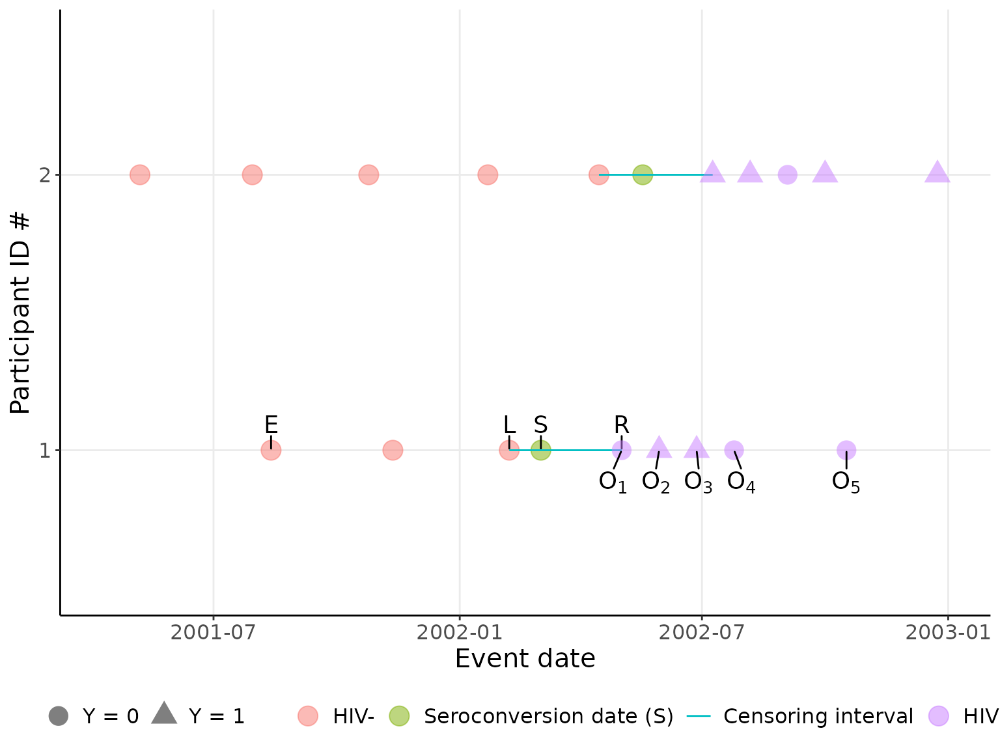

# visualize-study-design

``` r
library(rwicc)
```

This vignette demos the study design.

``` r

set.seed(16); 
simulate_interval_censoring(
    study_cohort_size = 2, 
    years_in_study = 10, 
    probability_of_ever_seroconverting = 1) |> 
    plot_censoring_data(
      included_IDs = 1:2,
      labelled_IDs = 1,
      s_vjust = -1,
      xmax = lubridate::ymd("2003-01-01")
    ) |> 
    print()
#> Warning: Removed 27 rows containing missing values or values outside the scale range
#> (`geom_point()`).
#> Warning: Removed 14 rows containing missing values or values outside the scale range
#> (`geom_text_repel()`).
```


